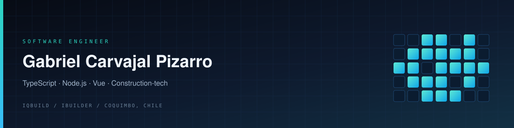

  

  
  &nbsp;
  
  &nbsp;
  

  

 

I design and build the services behind **iBuilder**: APIs, data models, and Vue surfaces for planning, production control, and site operations.

<table>
  <tr>
    <td width="50%" valign="top">

### Focus
- TypeScript services and domain APIs
- Vue product interfaces
- Production systems in construction-tech

    </td>
    <td width="50%" valign="top">

### Now
- Shipping planning and production systems at [iQbuild](https://github.com/iqbuild)
- Based in Coquimbo, Chile

    </td>
  </tr>
</table>
